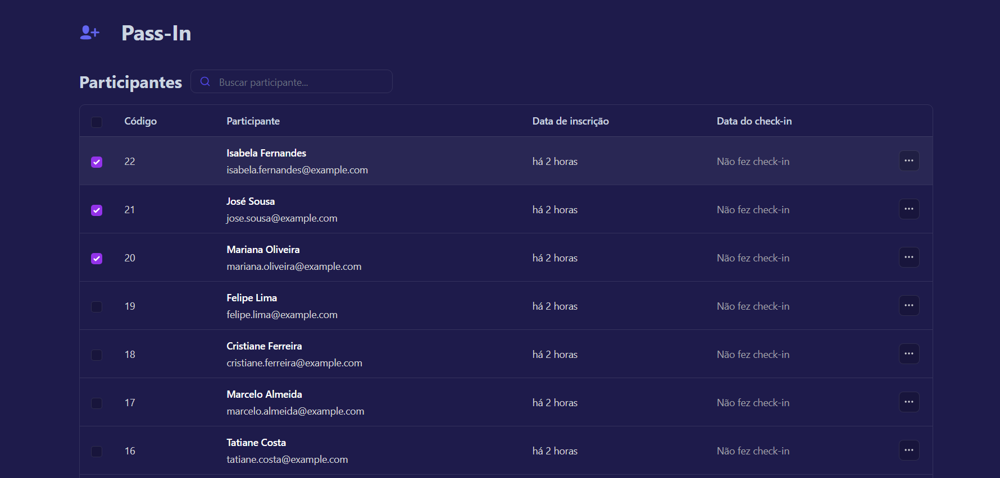

# Description

Pass.in is an application for **managing participants in in-person events**. This repository contains only the Front-End of the application developed during the NLW Unite. The Back-End can be found [here](https://github.com/jessrbl/API-PassIn)!

## Project Image

## Enhancements

- [x] Changed the project's background and added a different background for the checkbox when clicked.
- [x] Included a different icon in the navbar, as I thought it matched the application's purpose better.

## Technologies Used

- React
- Tailwind CSS
- TypeScript

## Status

## ✨ Author

<table>
  <tr>
    <td align="center">
      <a href="https://github.com/jessrbl">
         
        
          <b>Jéssica F. Rebelo</b>
        
      </a>
    </td>
  </tr>
</table>
