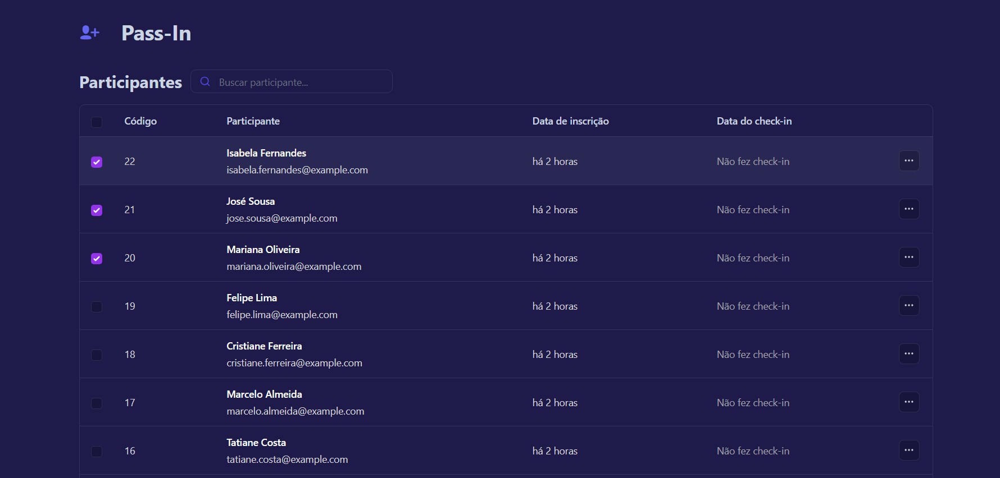

<h6> <a href = "https://github.com/jessrbl/PassIn-React/blob/main/README-EN.md"> English version </a></h6>

# Descrição

O pass.in é uma aplicação de **gestão de participantes em eventos presenciais**. 
Esse repositório contém apenas o Front-End da aplicação desenvolvido durante o NLW Unite. O Back-End pode ser encontrado <a href="https://github.com/jessrbl/API-PassIn"> aqui! </a>

___ 

## Imagem do projeto

___

## Aprimoramento

- [X] Mudei o background do projeto, e coloquei um fundo diferente para o *checkbox* quando este é clicado;
- [X] Incluí um ícone diferente na *navbar*, pois achei que este combinava mais com o objetivo da aplicação;

___

## Tecnologias Utilizadas
- ``React``
- ``Tailwind CSS``
- ``Typescript``

___

## Status

___

<h2> ✨ Autor</h2>

<table>
  <tr>
    <td align="center">
      <a href="https://github.com/jessrbl">
         
        
          <b>Jéssica F. Rebelo</b>
        
      </a>
    </td>
  </tr>
</table>

